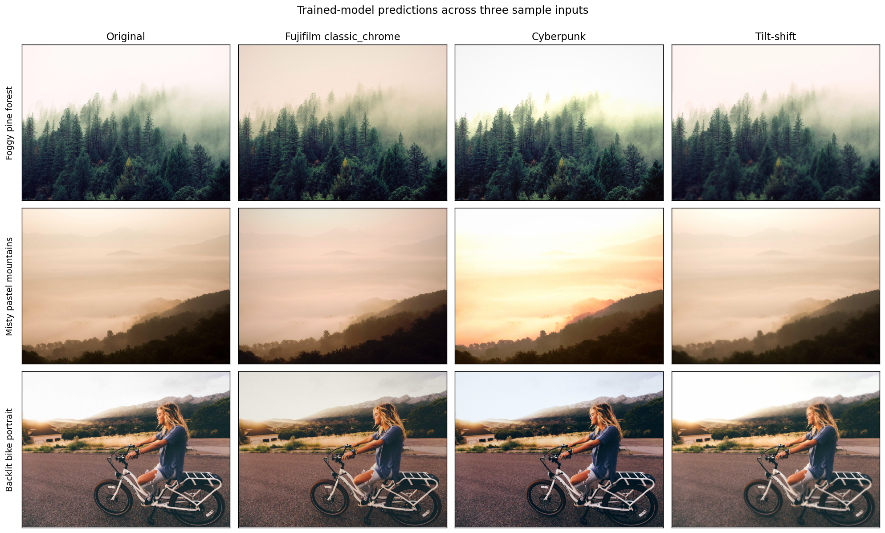

# Image Editing: Content-Adaptive, Editable Photo Styles

**Purpose.** Learn the photo edit that takes *this particular image* to a
target look. A style is a target appearance, not a fixed filter: a dark
street and a bright beach need different edits to reach the same look. The
look is learned either from a photographer's before/after pairs (e.g.
MIT-Adobe FiveK experts) or from a set of example photos already in the
style (e.g. cyberpunk, film). One model is conditioned on the chosen style.
It outputs **editable parameters** (curves, colour matrix, a small LUT,
grain, vignette) that bake to a `.cube` file, never generated pixels. It is
designed to train on a CPU from tens to hundreds of examples per style.

**Try it:** <https://kyleyhw.github.io/image_editing/>. Studio runs the model in your
browser, so your photos never leave your device.

**Status.** The plan in [`PROJECT_PLAN.md`](PROJECT_PLAN.md) has been run
end to end on a 4-core CPU. Every phase gate outcome, course correction and
open decision is in **amendment A4**. Highlights, on FiveK landscapes:

- **Content-adaptive beats one-size-fits-all.** The learned head improves
  with data (20.6 → 22.2 dB from 10 to 1,882 pairs) while a static preset
  stays flat at about 21.1 dB. Shrinkage calibration keeps small-data
  styles from overshooting.
- **One model, many styles.** A style-conditioned head beats per-style
  models (+0.7 dB). A new style fitted from **20 before/after pairs**
  beats a model trained on 132.
- **Simple, editable renderer.** Per-channel curves + colour matrix match
  3D LUTs and a per-pixel MLP within 0.4 dB. Regional edits (sky,
  graduated filter) add little for these edits, so they stay manual tools.
- **Styles from example photos only** work modestly (pseudo-pairs); pairs
  are better.
- **Clean Cool** (the first look, landscapes) passes its pilot gate. Day
  scenes can come out over-muted, which is an open decision for the owner.
- **Depth-aware haze / dehaze / clarity**: Depth Anything V2 Small, about
  1 s per photo.
- **Studio:** a web app (Svelte) with a WebGL preview (matches the Python
  renderer to 1/255). Hover a look to preview it on your photo; the room is lit
  by the edit. Curves, colour, a Scene panel (haze, clarity, sky light), batch,
  create-a-style, personalisation, and `.cube` / XMP / JPEG export. It is
  **hosted on GitHub Pages** with the model running in the browser (ONNX Runtime
  Web; matches PyTorch to 0.35/255), or run it locally with everything. See the
  [user guide](docs/user_guide.md).
- **New styles from an idea:** `photostyle style …` (or Studio → Create
  style → An idea). Describe a look, pick openly licensed photos that have
  it, and get a trained style with attribution.
- **Looks:** `cyberpunk` is a recipe transcribed from public grading
  tutorials as Lightroom-style slider settings, each value with its source
  ([docs/looks.md](docs/looks.md)), and the model is trained on photos graded
  by it (`--recipe teacher`). `fujifilm` is trained directly on 46 openly
  licensed Fuji film scans; its tutorial recipe is kept as a candidate.
- **Shared style base:** one model for many styles. A new style is a small
  code: fitted on 20 before/after pairs, or read instantly from example
  photos.

Phase reports are in [`tests/reports/`](tests/reports/). The research
direction is summarised in
[`reports/project_direction/project_direction.pdf`](reports/project_direction/project_direction.pdf).
Phases 1–6 (the earlier, broader groundwork: fixed-function styles and a
Streamlit UI) are kept below and in `legacy/`.

## Examples of every trained mode

The figure below (Phases 1–6, now in `legacy/`) was produced by `legacy/tools/make_examples.py`. Rows
are deliberately diverse sample images; columns are the original input
and the trained-model output for each style. Sample images were chosen
to exercise different aspects of each style:

- *Foggy pine forest* — strong vertical sky/ground contrast for
  tilt-shift; saturated greens for tone-curve probing.
- *Misty pastel mountains* — already warm and low-saturation, so the
  cyberpunk grade has to push aggressively to differentiate.
- *Backlit bike portrait* — full photographic scene with a centred
  human subject, ideal for showcasing tilt-shift's focus band.



How to read it:

- **Fujifilm Classic Chrome column.** Each output is a slightly darker,
  warm-shifted version of its row's original — exactly the recipe's
  signature (negative WB-blue shift, soft highlights, ~20% vignette).
  The effect is intentionally subtle; Classic Chrome is a "look", not a
  filter.
- **Cyberpunk column.** Each output reproduces the teal-and-orange
  S-curve: shadows crushed, highlights lifted, R/G channels pulled
  down and B pushed up. The transformation is most visible on the
  pastel mountains, where the warm fog is pushed into an unmistakable
  orange-teal sunset palette.
- **Tilt-shift column.** A horizontal sharp band remains in the middle
  of every output while sky and foreground are progressively blurred.
  The model recovers the focus-band geometry to within $|\Delta| < 0.01$
  on both centre and width; the blur amount saturates at roughly half
  of the data generator's, a known optimisation artefact documented in
  `models/tilt_shift.py`.

Full quantitative interpretation (per-channel mean shifts,
effect-magnitude ratios, target-vs-prediction comparison on a held-out
test image) is in
[`tests/reports/phase3_to_phase6_report.md`](tests/reports/phase3_to_phase6_report.md).

## MIT-5K: where the NN earns its complexity

The synthetic styles above all reduce to closed-form functions
$G(\mathbf{I})$ that the data-generator code computes exactly; running
$G$ directly is always faster and more accurate than the NN. The
network's value emerges only when there is no $G$ — when the target is
a real human edit that depends on image content.

Path 1 of the viability analysis pivots to exactly that regime: train
against expert C's retouches from MIT-Adobe FiveK. 80 paired
(`original`, `expert_c`) images were streamed from
`logasja/mit-adobe-fivek` on HuggingFace via
[`tools/download_fivek_subset.py`](tools/download_fivek_subset.py),
then the generic architecture trained for 12 epochs. The held-out
evaluation on 5 unseen test pairs is shown below.

*Figure removed (2026-09-24): it showed MIT-Adobe FiveK images without checking their licence, and some FiveK images are licensed for research only. The numbers below are unchanged.*

The headline number:

| | $L_1$(input, expert) | $L_1$(pred, expert) |
|---|---|---|
| **mean over 5 held-out pairs** | **0.0917** | **0.0741** |

i.e. the model's prediction lands ≈ 19 % closer to expert C's edit than
the original input does. **4 of 5 test pairs move toward the expert.**
The fifth (img_0003, glacier) is now only marginally away
($\Delta = -0.002$); the training set is dominated by warm urban /
portrait scenes so cool alpine palettes remain underweighted.

This is qualitatively different from the synthetic results: the NN is
now producing *image-dependent* parameter predictions, not imitating a
fixed function. The 21-D renderer is performing the same role as
before, but the head's predictions actually vary with input content.
Full methodology, training trajectory, and per-image direction analysis
is in
[`tests/reports/mit5k_expert_c_report.md`](tests/reports/mit5k_expert_c_report.md).

### Scaling experiment: 80 → 500 pairs

A follow-up run trained the same architecture on a 500-pair MIT-5K
subset (downloaded with the same script). The expectation was that
more data would close the magenta-cast failure case on the alpine
landscape. The result was the opposite — held-out mean L1 to expert
rose from 0.0741 to 0.1030, and only 1 / 5 test pairs moved toward
the expert (vs. 4 / 5 at 80 pairs).

The mechanism is a known failure mode of fixed-capacity content-
conditional heads: with 500 diverse training pairs the gradient pulls
the head's output in contradictory directions (one image wants more
saturation, the next less) and the optimiser converges on a less
aggressive but miscalibrated transformation that hedges across the
training distribution. The 21-D head plus the renderer's global
primitives (a single tone curve, a single 3 × 3 colour matrix per
image) hits an architectural ceiling.

Two paths to lift the ceiling are documented in
[`tests/reports/mit5k_expert_c_report.md`](tests/reports/mit5k_expert_c_report.md)
§ 9: a higher-capacity head (wider MLP or mixture of experts) or
per-pixel parameter maps via a U-Net-style decoder (Phase 5's
unfinished extension). The 80-pair checkpoint remains the better
deliverable for the current architecture, and the 500-pair experiment
is shipped as a documented negative result.

> **Revised reading (2026-09).** The "architectural ceiling" explanation
> is not yet supported. The run had uncontrolled factors: a fully fine-tuned
> ResNet with BatchNorm at batch size 4, no ImageNet normalisation, 8 vs. 12
> epochs, one seed, and 5 test images. The literature also finds
> that global, image-adaptive edits capture most of FiveK's expert
> retouching. Phase 7 of [`PROJECT_PLAN.md`](PROJECT_PLAN.md) re-tests this
> with a proper learning curve.

## Documentation index

| Document | Contents |
|---|---|
| [`docs/user_guide.md`](docs/user_guide.md) | How to use Studio, the command line and the new-style pipeline. |
| [`tests/reports/`](tests/reports/) | One report per phase (learning curve, renderers, regional, conditioning, unpaired, atmosphere, sky, Clean Cool, new-style pipeline). |
| [`CHANGELOG.md`](CHANGELOG.md) · [`CONTRIBUTING.md`](CONTRIBUTING.md) | What changed; how to work on the project. |
| [`legacy/docs/architecture.md`](legacy/docs/architecture.md) | *(legacy)* Mathematics of the feature extractor, every primitive, and the composite loss. Identity-at-init proof. |
| [`legacy/docs/training_and_inference.md`](legacy/docs/training_and_inference.md) | *(legacy)* Operational guide: data generation, training each architecture, CLI inference, Streamlit UI. |
| [`legacy/docs/roadmap.md`](legacy/docs/roadmap.md) | *(legacy)* Phase-1 design rationale and historical context that motivated the architecture choices. |
| [`PROJECT_PLAN.md`](PROJECT_PLAN.md) | Purpose, users, success metrics, target architecture, Phase 7 – 17 roadmap, UI/UX spec, data and evaluation plans, risks, and amendments A1–A5 (results and decisions). |
| [`reports/project_direction/project_direction.pdf`](reports/project_direction/project_direction.pdf) | One-page research report (PDF, Typst source alongside) on the revised purpose and recommended architecture. |
| [`reports/Content adaptive photo edit models.md`](reports/Content%20adaptive%20photo%20edit%20models.md) | Full literature comparison: Zeng et al. 3D LUTs and 17 alternatives. |
| [`tests/reports/phase3_to_phase6_report.md`](tests/reports/phase3_to_phase6_report.md) | End-to-end verification, including MCP-driven UI test. |

## Mathematical overview

For an input image $\mathbf{I} \in \mathbb{R}^{H \times W \times 3}$ the
network $\varphi$ predicts a parameter vector $\theta \in \mathbb{R}^P$
which the renderer $R$ converts to a styled image
$\tilde{\mathbf{I}} = R(\mathbf{I}; \theta)$.

The feature extractor concatenates two views of the image:

- a **differentiable CDF** per channel,
  $F_{c,k} = \sum_{k' \le k} p_{c, k'}$ with soft (Gaussian-binned)
  PDF $p_{c, k}$ — global tonal/colour statistics, 768 floats;
- a **ResNet-18 global average-pooled feature** — local spatial
  structure, 512 floats.

These are concatenated to a 1280-D descriptor and fed to a small MLP
head whose output dimension matches the chosen renderer:

| Architecture | $P$ | Parameter layout |
|---|---|---|
| Fujifilm (legacy) | 7 | Highlight, Shadow, Saturation, WB Red, WB Blue, Grain, Vignette |
| Generic | $K - 2 + 14$ (21 at $K = 9$) | Tone-curve interior knots ($K-2$), $3 \times 3$ colour matrix offset (9), colour bias (3), grain (1), vignette (1) |
| Tilt-shift | 24 | Generic 21-D + focus band (centre, width, blur strength) |

The renderer's primitives are designed to be identity at zero output,
so an untrained network produces $\tilde{\mathbf{I}} = \mathbf{I}$ and
any non-zero loss decrease unambiguously reflects learned behaviour.

The composite loss is

$$
\mathcal{L} = \lambda_{\text{pixel}} \,\|\tilde{\mathbf{I}} - \mathbf{I}^\star\|_1
   + \lambda_{\text{percep}}\,\frac{1}{|\mathcal{T}|}\sum_{\ell \in \mathcal{T}}\|\Phi_\ell(\tilde{\mathbf{I}}) - \Phi_\ell(\mathbf{I}^\star)\|_1
   + \lambda_{\text{cdf}}\,\|F(\tilde{\mathbf{I}}) - F(\mathbf{I}^\star)\|_1,
$$

where $\Phi_\ell$ are activations of a frozen ImageNet-pretrained VGG-16
at four canonical taps (`relu1_2`, `relu2_2`, `relu3_3`, `relu4_3`) and
$F$ is the differentiable CDF from above. Full derivations and the
HSV-faithful colour identities used by the Fujifilm renderer are in
[`legacy/docs/architecture.md`](legacy/docs/architecture.md).

## Project structure

```
.
├── PROJECT_PLAN.md          # purpose, architecture, roadmap, UI/UX spec, amendments A1–A5
├── README.md · CHANGELOG.md · CONTRIBUTING.md · LICENSE (MIT)
├── pyproject.toml · uv.lock # uv-managed deps (CPU-only PyTorch on Linux/Windows)
│
├── photostyle/              # the engine
│   ├── features.py          # frozen ResNet-18 + per-channel CDF descriptor
│   ├── render.py            # per-channel curves + colour matrix + vignette (differentiable)
│   ├── head.py · condition.py   # content-adaptive head; style conditioning, shared base, coded styles
│   ├── train.py · looks.py  # paired / unpaired learning, look profiles, losses
│   ├── regional.py · sky.py · atmosphere.py   # regional tools, learned sky mask, depth-aware scene tools
│   ├── engine.py · export.py · io.py          # EditParams, style packs, .cube / XMP export, RAW/ICC I/O
│   ├── newstyle.py · openverse.py             # idea → references → style pipeline
│   └── cli.py               # `photostyle` command
├── studio/                  # the app: FastAPI server, Svelte source (web/), built UI (dist/), v1 page (static/)
├── bench/                   # benchmarks and phase experiments (results in bench/results/)
├── tools/                   # data collection, style-pack and base building, end-to-end checks
├── tests/                   # unit tests; tests/reports/ holds every phase report
├── docs/user_guide.md       # how to use Studio, the CLI and the new-style pipeline
├── reports/ · research_notes/   # research report and literature review
└── legacy/                  # Phases 1–6 (fixed-function styles, Streamlit UI); run from inside legacy/
```

Not in git: `data/` (datasets, your photos, caches), `checkpoints/`,
`stylepacks/` (rebuild with `tools/build_stylepacks.py`).

## Quick start

```
uv sync
uv run photostyle serve                    # Studio at http://127.0.0.1:8765
uv run photostyle styles list
uv run photostyle apply --style fujifilm photos/*.jpg -o out/ --cube
uv run photostyle style new my_look --describe "soft pastel morning light"   # then: search, pick, train, pack
```

See the [user guide](docs/user_guide.md). The Phases 1–6 tools (synthetic
styles, Streamlit UI) are in [`legacy/`](legacy/README.md).

## Licence

Code: [MIT](LICENSE). Datasets and model weights keep their own licences and are
not in this repository. MIT-Adobe FiveK and anything trained on it (the
`fivek_c_landscape` and `clean_cool` style packs) are for research and
personal use only. The openly licensed style-seed images need the
attribution recorded in `data/manifests/`. Depth Anything V2 Small is
Apache-2.0. See `PROJECT_PLAN.md` A4.5 for the commercial-use checklist.

The hosted Studio ships only packs trained on openly licensed photos
(`studio/web/pages/models/styles.json`; attribution inside it), the torchvision
ResNet-18 ImageNet weights, public-domain sample photos
(`studio/web/public/samples/ATTRIBUTION.md`) and the Geist / Instrument Serif fonts (OFL).

## References

<span id="ref-he-2016">[1]</span> He, K., Zhang, X., Ren, S. & Sun, J. (2016). *Deep Residual Learning for Image Recognition.* CVPR. [Link](https://doi.org/10.1109/CVPR.2016.90)

<span id="ref-simonyan-2014">[2]</span> Simonyan, K. & Zisserman, A. (2014). *Very Deep Convolutional Networks for Large-Scale Image Recognition.* arXiv:1409.1556. [Link](https://arxiv.org/abs/1409.1556)

<span id="ref-johnson-2016">[3]</span> Johnson, J., Alahi, A. & Fei-Fei, L. (2016). *Perceptual Losses for Real-Time Style Transfer and Super-Resolution.* ECCV. [Link](https://arxiv.org/abs/1603.08155)

<span id="ref-bychkovsky-2011">[4]</span> Bychkovsky, V., Paris, S., Chan, E. & Durand, F. (2011). *Learning Photographic Global Tonal Adjustment with a Database of Input/Output Image Pairs.* CVPR. [Link](https://doi.org/10.1109/CVPR.2011.5995332)
