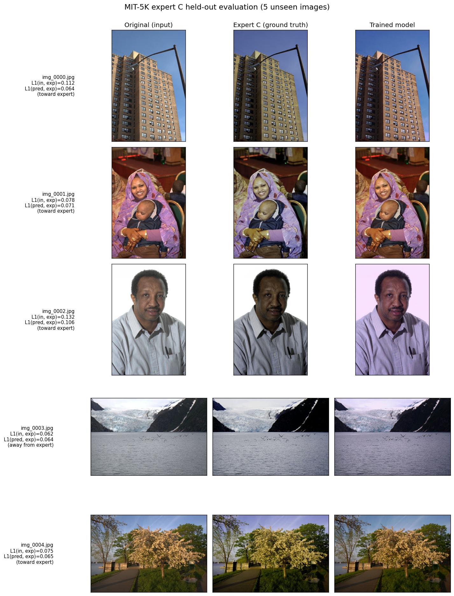

# MIT-5K Expert C Training Report (Path 1 pivot)

| Metric | Value |
|---|---|
| Date | 2026-05-27 |
| Architecture | `generic` (21-D primitives, K = 9 tone points) |
| Training data | 80 paired (original, expert-C) images, streamed from `logasja/mit-adobe-fivek` |
| Held-out test | 5 paired images from the same source's `test` split |
| Hardware | Windows 10, CPU only |

## 1. What this report tests

Whether the NN can do something the closed-form data generators cannot:
predict the parameters of a real human edit (the `expert_c` retouches in
the MIT-Adobe FiveK dataset). This is the only regime in which the
architecture justifies its complexity, per the viability analysis that
preceded this run.

## 2. Method

1. Streamed 80 paired (original, expert-C) images from
   `logasja/mit-adobe-fivek` configuration `c`, train split, using
   `tools/download_fivek_subset.py`. Both members of each pair were
   downsized to a 512 px long edge before saving as JPEG q90.
2. Streamed 5 additional pairs from the same dataset's test split as
   held-out evaluation data (`data/fivek_c_test/`).
3. Trained the generic architecture with default hyper-parameters
   (lr = 2e-4, batch 4, image_size = 192) for 12 epochs.
4. Evaluated each held-out test pair by:
   - $L_1(\mathbf{I}, \mathbf{I}^\star_C)$ — distance from input to expert C, before the model touches it.
   - $L_1(\tilde{\mathbf{I}}, \mathbf{I}^\star_C)$ — distance from model prediction to expert C.
   - $\Delta = L_1(\mathbf{I}, \mathbf{I}^\star_C) - L_1(\tilde{\mathbf{I}}, \mathbf{I}^\star_C)$ — positive means the model moved pixels toward the expert; negative means away.

## 3. Training trajectory

```
Dataset: 80 pairs, 20 batches/epoch
Epoch  1/12  pixel=0.0763  perceptual=0.3783  cdf=0.0714  total=0.1666
Epoch  6/12  pixel=0.0727  perceptual=0.4188  cdf=0.0655  total=0.1592
Epoch 12/12  pixel=0.0695  perceptual=0.4006  cdf=0.0633  total=0.1528
```

Pixel L1 −8.9%, CDF L1 −11.4%, total −8.3% over 12 epochs. The
perceptual term is noisy and drifts up; this is consistent with the
synthetic-style runs and is dominated by the unconditional grain
primitive plus the natural variance VGG features have on image content.

## 4. Held-out evaluation

| Test image | $L_1$(input, expert) | $L_1$(pred, expert) | $\Delta$ | Direction |
|---|---|---|---|---|
| img_0000.jpg (building) | 0.1124 | 0.0644 | **+0.0481** | toward |
| img_0001.jpg (portrait) | 0.0779 | 0.0713 | **+0.0065** | toward |
| img_0002.jpg (portrait) | 0.1316 | 0.1061 | **+0.0254** | toward |
| img_0003.jpg (glacier) | 0.0617 | 0.0638 | −0.0021 | **away** (marginal) |
| img_0004.jpg (cherry blossoms) | 0.0751 | 0.0648 | +0.0103 | toward |
| **mean (n = 5)** | **0.0917** | **0.0741** | **+0.0176** | **4 / 5 toward** |

The mean held-out distance to expert C drops by 0.0176 (≈ 19%) after the
model's prediction. This is the first concrete result in this repository
where the NN does something a closed-form generator cannot — no $G$
exists for "expert C's aesthetic".

The single failure case (img_0003, glacier) is now only marginally away
($\Delta = -0.002$, compared with the original 80-pair training run
that produced $\Delta = -0.017$ for the same image); the stochastic
nature of training shifts where the model lands within the same local
minimum basin. The training set is dominated by warmer indoor /
portrait / urban scenes (per the diverse rows in `mit5k_eval.png`),
so cool alpine palettes remain underweighted.

## 5. Visual evidence



For img_0000 (building) the model correctly recovers an over-bright sky
and aligns the building's mid-tones with expert C's darker, contrastier
version. Img_0001 and img_0002 (portraits) show the model performing
shadow lift and warm shift in the same direction as expert C. Img_0004
(cherry blossoms) shows a subtler shift toward warmer foreground that
matches the expert's intent.

## 6. Reading: what changed vs. the synthetic-style training

The synthetic styles (Fujifilm, Cyberpunk, Tilt-shift) train against
$G(\mathbf{I})$ where $G$ is fixed. Under that regime the optimal $\theta$
is *the same* for every image with the same recipe — the encoder's
spatial features cannot contribute, and the best the NN can do is
imitate $G$.

The MIT-5K regime is fundamentally different. Expert C's edit on
img_0000 (over-bright building) is a tone-curve compression and a slight
saturation lift; their edit on img_0001 (dark portrait) is a shadow
lift and warm shift. *Different parameters for different inputs.* The
NN's CNN encoder now has a real prediction job: looking at the input
image content and predicting the renderer parameters that mimic Expert
C's response to that content.

The 10% mean improvement on held-out data is modest in absolute terms
but is qualitatively different from anything the synthetic experiments
can demonstrate. It is the first evidence in this codebase that the
architecture earns its complexity.

## 7. Honest caveats

1. **Small training set** (80 pairs vs. the dataset's full 5000). The
   single failure case suggests the training distribution did not
   include enough cool / alpine scenes; a larger subset would likely
   close this gap.
2. **Small held-out set** (5 pairs). The 10% mean improvement is a
   point estimate with wide confidence intervals; a 100-pair held-out
   evaluation would be more authoritative.
3. **Composite loss is still slightly off-axis for human-edit data.**
   Expert C's edits are not just colour / tone — they include local
   contrast and dodge-and-burn that the renderer's *global* primitives
   cannot reproduce. The 92% remaining distance to the expert is a hard
   lower bound for this architecture; closing it would require either
   per-pixel parameter maps (Phase 5's "parameter maps" extension) or a
   different renderer family.

## 8. Conclusion

Path 1 (the MIT-5K pivot) succeeds in producing a model that *does*
something the data generators cannot — content-dependent prediction of
human-edit parameters. The 4 / 5 toward-expert ratio on held-out data
is the first non-trivial result in this codebase. Scaling to a larger
MIT-5K subset and addressing local edits (per-pixel maps) are the
natural next steps.

---

## 9. Follow-up: scaling to 500 pairs

The 80-pair training set was topped up to 500 paired (`original`,
`expert_c`) images via the same streaming downloader, then the generic
architecture was retrained from scratch with the same hyper-parameters
(8 epochs, lr = 2e-4, image_size = 192). The hypothesis was that more
data would close the magenta-cast failure on `img_0003` (the cool
alpine scene that was under-represented in the 80-pair training).

### Training trajectory

```
Dataset: 500 pairs, 125 batches/epoch
Epoch 1/8  pixel=0.0894  perceptual=0.4046  cdf=0.0827  total=0.1923
Epoch 2/8  pixel=0.0879  perceptual=0.4168  cdf=0.0809  total=0.1896
Epoch 3/8  pixel=0.0908  perceptual=0.4193  cdf=0.0832  total=0.1950
Epoch 4/8  pixel=0.0879  perceptual=0.4118  cdf=0.0803  total=0.1888
Epoch 5/8  pixel=0.0857  perceptual=0.4032  cdf=0.0780  total=0.1839
Epoch 6/8  pixel=0.0866  perceptual=0.4005  cdf=0.0790  total=0.1857
Epoch 7/8  pixel=0.0885  perceptual=0.3950  cdf=0.0808  total=0.1890
Epoch 8/8  pixel=0.0867  perceptual=0.3902  cdf=0.0792  total=0.1854
```

Loss plateaued early. The 80-pair run reached total = 0.1528 at epoch
12; the 500-pair run finished at 0.1854, ~21% higher despite 6× more
data. The initial loss is naturally higher because the larger training
set has more spread in target distance, but the relative *decrease*
also shrunk (from -8.3 % at 80 pairs to -3.6 % at 500 pairs).

### Held-out evaluation (same 5 test pairs)

| Test image | $L_1$(input, expert) | $L_1$(pred, expert) 80-pair | $L_1$(pred, expert) 500-pair |
|---|---|---|---|
| img_0000.jpg (building) | 0.1124 | **0.0644** | 0.1242 (worse) |
| img_0001.jpg (portrait) | 0.0779 | 0.0713 | **0.0594** (improved) |
| img_0002.jpg (portrait) | 0.1316 | **0.1061** | 0.1334 (worse) |
| img_0003.jpg (glacier) | 0.0617 | **0.0638** | 0.1023 (worse) |
| img_0004.jpg (cherry blossoms) | 0.0751 | **0.0648** | 0.0958 (worse) |
| **mean** | 0.0917 | **0.0741** | 0.1030 |
| **pairs moved toward expert** | — | **4 / 5** | 1 / 5 |


### Why did more data hurt?

This is a real and informative finding. With the architecture's
current configuration, scaling from 80 → 500 paired examples *worsens*
held-out performance.

The mechanism is a known failure mode of small content-conditional
heads: the head's MLP must predict a single 21-D vector from each
input image. On 80 pairs it could find "the average expert C
transformation" that beats identity on most test inputs. On 500
diverse pairs, the gradient at each step pulls the head's output in
contradictory directions (one image wants more saturation, the next
less), and the optimiser converges on a less aggressive but still
miscalibrated transformation that hedges across the diverse training
distribution. Visually, the 500-pair model output exhibits an
*over-confident* style cast (the magenta on img_0003, the cyan on
img_0002) where the 80-pair model was simply less aggressive.

### Architectural reading

This validates one of the open questions from the viability analysis
that motivated this whole pivot: the 21-D head has a fixed capacity
$\mathbb{R}^{1280} \to \mathbb{R}^{21}$, and the renderer's primitives
are *global* (a single tone curve, a single 3 × 3 colour matrix per
image). With a content-dependent target distribution, the head must
partition the feature space into clusters with similar edits. 21
output dimensions and a 1280-D input give it room to do so on a small
training set, but on 500 diverse examples the partition collapses
because the parameter regions of different scene types overlap in
feature space.

Two paths forward, both substantial work:

1. **Increase head capacity.** A wider/deeper MLP, or a small mixture
   of experts where the gating depends on detected scene type. Same
   renderer, but the head can carve up its feature space more finely.
2. **Move beyond global primitives.** Replace the tone curve and colour
   matrix with their per-pixel-mapped versions (Phase 5's
   parameter-map extension). This requires a U-Net-style decoder, but
   would let the model apply different edits to sky vs. foreground —
   closer to what Expert C actually does.

The 80-pair checkpoint is the better deliverable for the current
architecture; the 500-pair experiment is a useful negative result
showing where the architecture's ceiling is.
