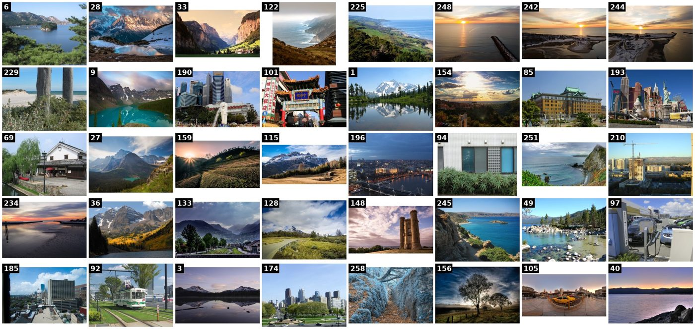
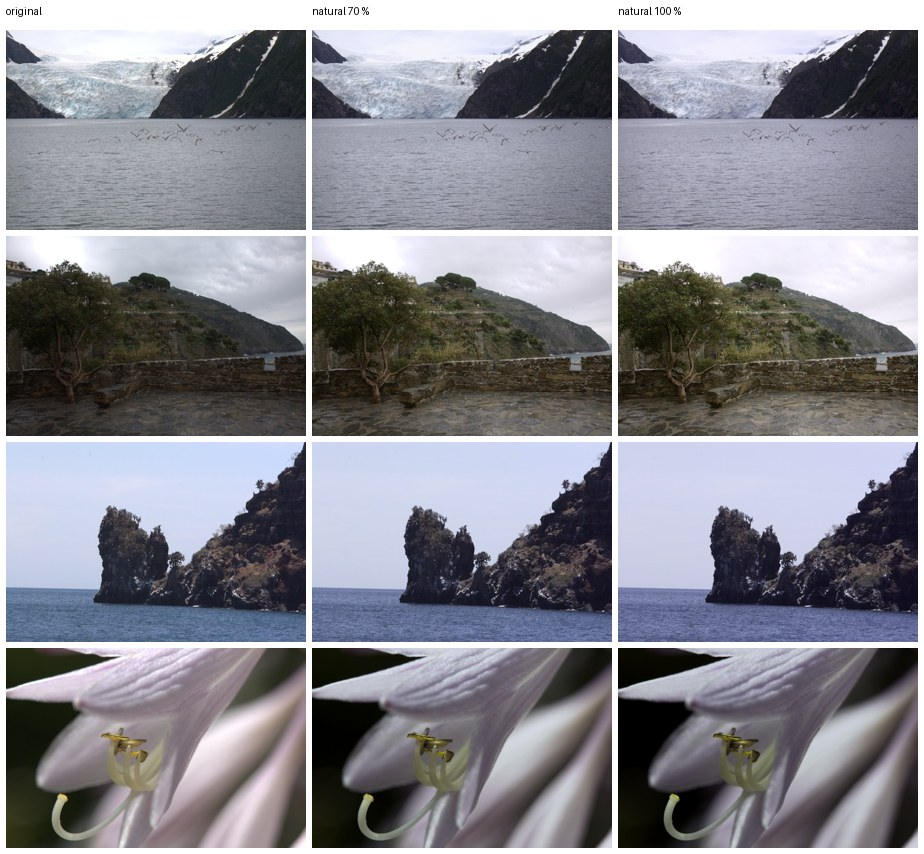
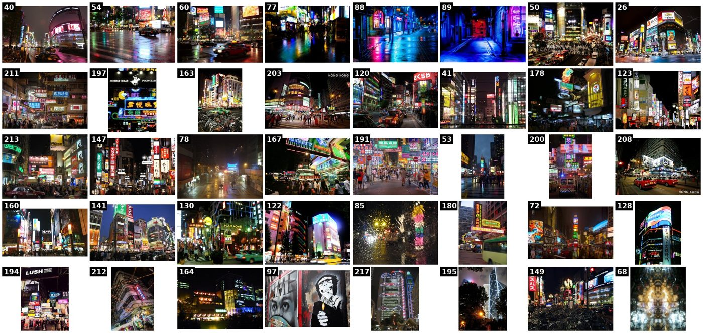
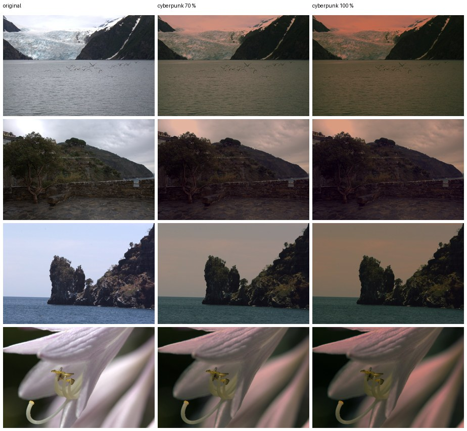

# New-style pipeline: from an idea to a style (and two placeholder styles)

The owner's direction (PROJECT_PLAN A5): use *natural* and *cyberpunk* as
placeholder looks, and make creating a new style one streamlined flow.
Both placeholders were made with that flow.

## The flow

```
photostyle style new NAME --describe "..."   →  search  →  pick  →  exclude  →  train  →  preview  →  pack
```

It is the same in Studio (**+ Create style → An idea**). Step details are
in `docs/user_guide.md` and PROJECT_PLAN A5.1.

**Owner effort.** One sentence, clicking the photos whose look you like,
dropping any misfits, and choosing a recipe. Everything else is automatic:
licences, dedupe, the person filter, "more like these", training and
packing with attribution.

## Placeholder 1: `natural`

- **References.** 303 openly licensed candidates from 6 queries (mountain
  lake, Japan street daylight, countryside, city skyline, coast, forest
  trail). Picks: the four photos of the owner's look-gallery row 1. Plus
  the closest 36; 5 dropped on review (a map graphic, a caption, a
  watermark, an odd crop, a macro).
- **Recipes tried:**
  - `gentle` (pseudo-pairs): a **pink cast on neutral greys**, and reds
    dulled. Rejected.
  - `instant` (the shared base's encoder reads a code from the 40
    references): neutral, a slight clean-up, nothing pushed. **Chosen**,
    default strength 100 %. Because it is a code on the FiveK-derived
    base, the pack is personal-use only.




## Placeholder 2: `cyberpunk`

- **References.** 217 candidates from 5 queries (cyberpunk city, neon city
  night rain, cyberpunk street, Tokyo/Hong Kong neon). Many top results
  are **digital renders**, not photos, so the picks were six real neon/rain
  street photos. Plus the closest 34; 5 dropped (a collage, an interior
  with a caption, a daytime shot, a kaleidoscope, an odd interior).
- **Recipe.** `strong`: pseudo-pairs + per-image colour-distribution
  matching + fidelity, on 307 input photos (the natural project's
  openly licensed candidates + the owner's unedited photos). 196 s.
  Default strength 80 %.
- **Result.** Teal shadows and water; pink-magenta on bright surfaces and
  skies; deeper blacks. A day photo takes the *colour* of the look but
  cannot gain neon lights (by design: no generated content). Night photos
  change little because they are already close.




*Previews: MIT-Adobe FiveK test images (Adobe-MIT licence). References:
openly licensed (CC0 / PDM / CC BY / CC BY-SA); credits in
`data/manifests/natural.csv` and `data/manifests/cyberpunk.csv`, and in
each pack's `ATTRIBUTION.csv`. The same previews on the owner's photos are
private (`data/owner/outputs/placeholders/`).*

## What the runs taught (and fixed)

| issue | fix |
|---|---|
| `pick` crashed on numpy integers in JSON | caught by a new offline unit test; fixed |
| the Openverse daily limit (200) was hit while building the input pool, and would have cached an empty pool | the input pool reuses already-downloaded openly licensed photos (+ owner's unedited) and never caches an empty pool |
| search results for stylised looks are often digital art | the review step (drop misfits) is part of the flow; backlog: a photo-vs-render classifier |
| `gentle` can add a colour cast on neutral images | `instant` (base encoder) is the better default for near-natural looks when the base exists |
