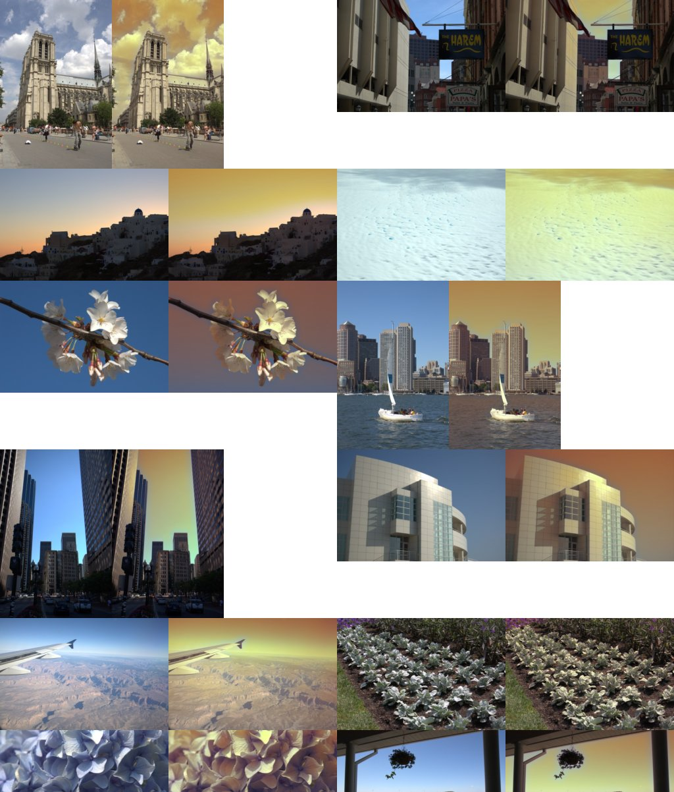

# Phase 16: regional edits on FiveK landscapes

**Gate (regional beats global by ≥ 0.5 dB): not met.** The planned fallback
applies. The regional stage (graduated filter, shadow/midtone/highlight
masks, sky mask) stays in the engine as **manual, editable tools**. It is not
added to the learned default. It remains the right path for looks that are
regional by design (e.g. a darkened sky), which FiveK expert C's edits
mostly are not.

## Results (expert C, landscape test subset, PSNR in dB; `bench/phase16.py`)

| | whole image | top third (≈ sky) | bottom two thirds |
|---|---|---|---|
| **oracle** global (per-image best, 40 images) | 28.85 | 30.19 | 28.74 |
| **oracle** global + regional | 29.04 | 30.65 | 28.86 |
| learned global, n = 250 | 21.61 | 21.63 | 22.02 |
| learned regional, n = 250 | 21.74 | 21.70 | 22.16 |
| learned global, n = 1,882 (all) | 22.06 | 22.14 | 22.44 |
| learned regional, n = 1,882 | 22.05 | 21.98 | 22.48 |

**Reading:**
- **The ceiling is low.** Even a per-image optimum gains only +0.19 dB from
  the regional stage (+0.46 dB in the sky band). Expert C's landscape
  edits are essentially global.
- **The learned models are about 7 dB below the global ceiling.** The
  bottleneck is predicting the right global edit per image, not the
  renderer's expressiveness. That is where the effort should go; Phase 9
  shows the same.
- The learned regional model gains +0.13 dB at 250 pairs and nothing at
  full data.

## Sky-mask halo audit

*Left of each pair: input. Right: sky probability in orange. Inputs:
MIT-Adobe FiveK, Adobe-MIT licence.*

- **Real skies:** found well, including blue, grey-cloud, sunset and
  street-canyon skies. Edges follow buildings and branches closely thanks
  to the guided filter; halos are thin.
- **False positives (the heuristic is colour + smoothness + position):**
  a snow field, a close-up of blue hydrangeas, calm water under a skyline,
  hazy ground seen from a plane, silver-leaved plants.

**Recommendation:** replace the heuristic with a learned sky segmenter
before any sky edit becomes automatic. This needs a licence decision (see
the open decisions). Until then, sky edits stay manual and at modest
strength.

## Engineering found and fixed

The box filter behind the sky mask and the guided filter was O(r²) per
pixel, so the sky mask took minutes at 12 MP. It is now separable and runs
on a 1024 px proxy: 5 s at 12 MP on one thread, same output.
