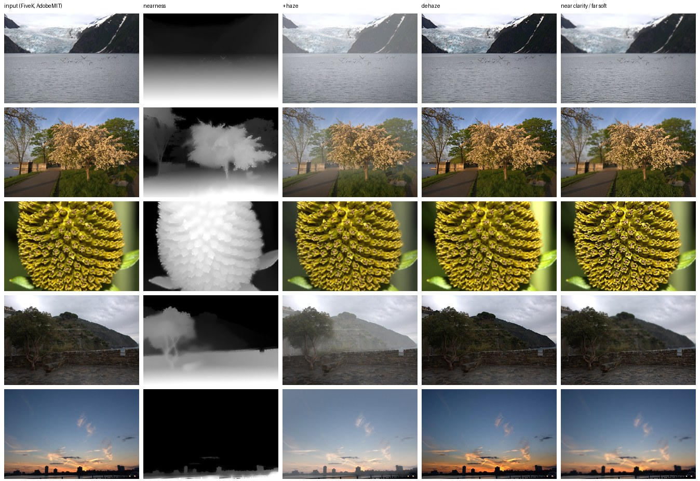

# Phase 18: depth-aware atmosphere (haze, dehaze, depth clarity)

**Status: works, adopted as an opt-in tool.** Every edit is parametric and
off by default, and it only re-weights existing pixels. Scope follows
amendment A2.4 (landscapes: atmosphere, not portrait depth-of-field).

## What it does

`photostyle/atmosphere.py`: depth from **Depth Anything V2 Small**
(Apache-2.0). It runs on a ≤518 px proxy, and its edges are re-snapped to
the image with a guided filter. If the model is unavailable, a transparent
fallback is used (vertical position + dark channel).

| control | effect |
|---|---|
| `haze` > 0 | blend toward a cool/warm atmospheric grey with distance |
| `haze` < 0 | dehaze: removes only the haze the dark channel says is there (He et al. 2009) |
| `clarity_near`, `clarity_far` | depth-weighted local contrast |
| `sky_*` | exposure / warmth / saturation inside the sky mask (Phase 16) |

## Checks (12 AdobeMIT FiveK nature test images, 1024 px; `bench/phase18.py`)

| check | result |
|---|---|
| all strengths 0 returns the input bit-exactly | yes (12/12) |
| +haze lowers far contrast more than near contrast | 12/12 (far ×0.62 median, near ×0.96) |
| dehaze raises far contrast | 12/12 |
| near clarity / far softening: near contrast rises more than far | 12/12 (near ×1.5, far ×0.66) |
| new clipped pixels, worst image | +haze 1.2 %, near/far clarity 1.9 %, dehaze 4.2 % (one sunset; 11 of 12 images ≤ 3 %, most ≈ 0) |
| depth model vs fallback agreement (Spearman) | median 0.76; negative on 2 images (close-ups, where "lower = nearer" is wrong) |
| runtime, 4-core CPU under load, 1 thread | depth 1.0 s at 1024 px (1.6 s for a 12 MP proxy); edit at 12 MP 6–7 s |

*Inputs: MIT-Adobe FiveK, Adobe-MIT licence (Bychkovsky et al., CVPR 2011).*

## Bugs found and fixed while running this

1. **Dehaze clipped skies to white** on the owner's photos. It also crushed
   haze-free distant terrain to black: the first version treated every far
   pixel as hazy.
   - The sky is now excluded.
   - Atmospheric light is the 95th percentile of the far region.
   - The strength is scaled by the dark-channel haze estimate, so the
     darkest channel cannot go negative.
2. **The sky mask took minutes at 12 MP.** The box filter was O(r²) per
   pixel. It is now separable (output identical to 1e-6), and large images
   use a 1024 px proxy: **5 s at 12 MP on one thread**, down from many
   minutes.

## Limits and follow-ups

- On close-ups and macro shots (e.g. the flower above) "distance" means
  little. The model's depth is still right there; the fallback is not.
- A learned "scene" head (predicting `SceneParams` per style) is not
  trained yet. A look would need paired examples that include atmosphere
  edits, which FiveK does not have. For now the controls are manual (API).
  Studio UI controls are in the backlog.
