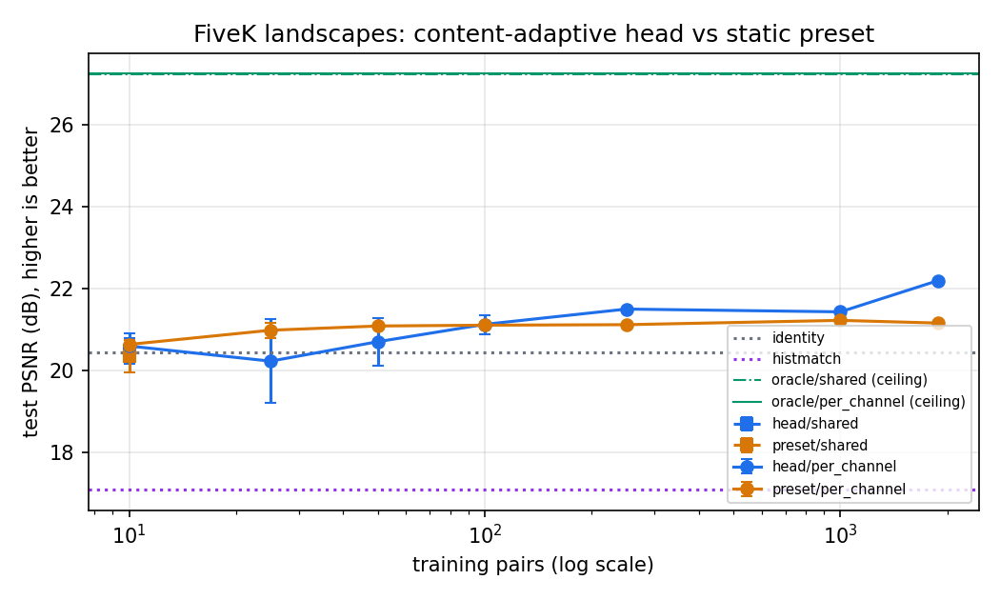

# Phase 7: learning curve on FiveK landscapes (expert C)

**Gate: passed. Accuracy rises with data.** The old "ceiling" story is
retired, and this curve is the small-data baseline. The content-adaptive
head beats the best static preset once it has about 100 pairs. With
shrinkage calibration (Phase 7b) it is never worse than the preset at small
n.

## Setup

- **Data:** MIT-Adobe FiveK, expert C, landscape subset (outdoor, man-made
  or nature). 1,882 train / 30 validation / 200-image test subset; 37 pairs
  that could not be aligned (crops) were dropped.
- **Model:** frozen ResNet-18 + CDF features (1,280-D) → MLP head →
  per-channel monotone curves + 3×3 colour matrix + bias. AdamW, early
  stopping on validation L1. 3 seeds for n ≤ 100, 1 seed above.
- **Command:** `uv run python -m bench.learning_curve --renderers per_channel`
  (full results in `bench/results/phase7_fivek_landscape_c/`).

## Results (test PSNR in dB, higher is better; ΔE2000 lower is better)

| method | 10 | 25 | 50 | 100 | 250 | 1,000 | 1,882 |
|---|---|---|---|---|---|---|---|
| static preset (one edit for all) | 20.64 | 20.98 | 21.09 | 21.11 | 21.12 | 21.22 | 21.16 |
| adaptive head, raw | 20.60 | 20.23 ± 1.03 | 20.70 | 21.13 | **21.50** | **21.43** | **22.19** |
| adaptive head + shrinkage (7b) | **20.97** | **21.12** | **21.50** | 21.13 | | | |
| worst seed, raw → shrinkage | 20.25 → 20.75 | 18.80 → 20.81 | 19.90 → 21.30 | 20.86 → 20.86 | | | |

**References:**
- identity (no edit): 20.45 dB / ΔE 9.16;
- histogram matching: 17.10;
- per-image oracle (the renderer's ceiling): 27.24 dB / ΔE 3.40.

At full data, the head's ΔE is 7.34, against 8.27 for the preset.

## Reading

1. **More data helps the adaptive model; the preset flattens at about
   21.1 dB by 50 pairs.** The gap grows to +1.0 dB at 1,882 pairs. That
   gain is what "content-adaptive" buys.
2. **Small data was unstable.** With 25–50 pairs, one seed in three
   produced a head worse than the unedited photo (18.8 dB).
   - **Fix:** shrinkage calibration, `photostyle.train.calibrate_shrinkage`.
     The prediction is pulled toward the head's own mean edit by a factor
     α chosen on the validation split.
   - **Result:** every small-n seed improved (+0.4 to +2.0 dB on the bad
     ones). At 100 pairs α = 1, so it switches itself off once there is
     enough data. It is on by default in `learn_paired` (CLI, Studio).
3. **The renderer is not the bottleneck.** The oracle shows the same
   renderer can reach 27.2 dB. The learned head reaches 22.2 dB, so
   prediction, not expressiveness, is where the 5 dB goes. Phases 9 and 16
   point the same way: richer renderers and regional stages add ≤ 0.2 dB.
4. **Absolute numbers are lower than published FiveK results** (about 25 dB
   for Zeng et al.). This is expected here:
   - the test set is landscapes only;
   - images are 512 px;
   - frozen features;
   - at most 1,882 pairs, not 4,500;
   - the CPU budget is small.

   Only comparisons within this table are meaningful.

## Not done from the original Phase 7 task list

- **Loss ablation** (L1 vs. L1 + CDF vs. composite): skipped. L1 with early
  stopping was stable, and the gap is in prediction, not in the loss
  surface.
- **Bootstrap 95 % CIs:** replaced by seed spread for n ≤ 100.
- **Frozen hashed manifests:** the file list is fixed by the downloader
  (shard order) and by seeds. SHA-256 manifests are in the backlog.
