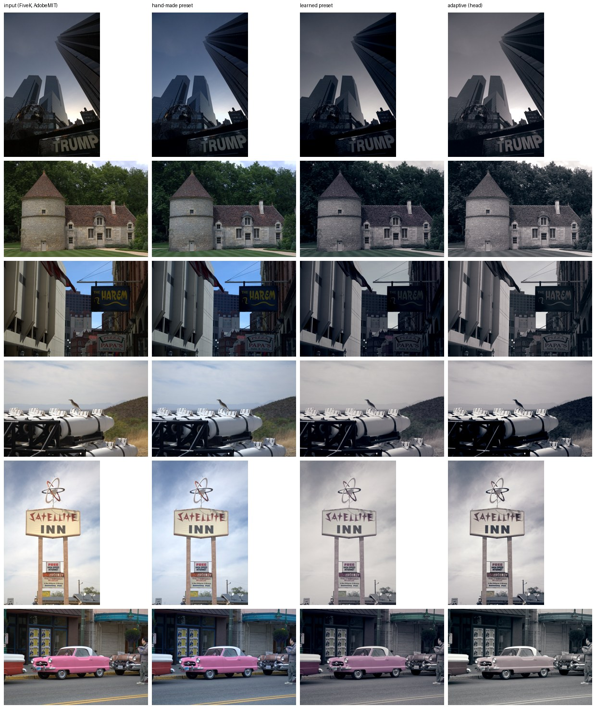
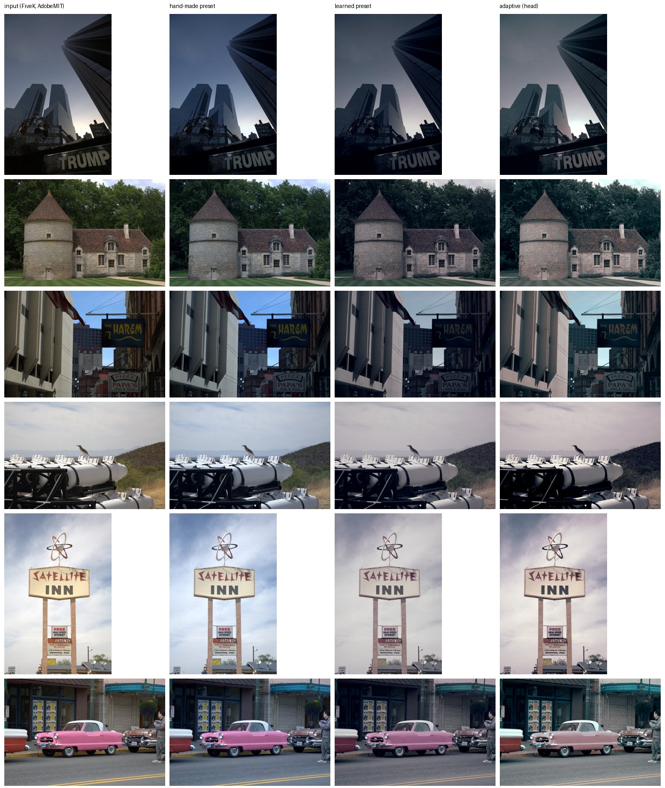

# Pilot A: "Clean Cool" landscapes, learned without pairs

**Gate: passed in all four cells.** The adaptive head beats the hand-made preset
on look-profile distance (whole image, top and bottom halves) with no new
clipping and detail similarity of 0.98 or higher. **Visual caveat:** by day
it also mutes colour more than the look intends. See "What the numbers miss".

## Setup

- **Look:** "Clean Cool" (`photostyle/looks.py`): deep but not crushed
  blacks, cool shadows, neutral highlights. At night, clean neon on a dark
  base; by day, airy and muted (target saturation 0.28, matching the seed
  set's median of 0.27).
- **Style examples:** 31 openly licensed photos (CC0/PDM/BY/BY-SA; 14 night,
  17 day). They were collected by `tools/collect_style_set.py`, with
  attribution in `data/manifests/clean_cool_landscape.csv`. No pairs.
- **Inputs (the photos to be edited):** 800 unedited FiveK originals,
  outdoor, man-made or nature. The test set is 160 other originals
  (52 night, 108 day).
- **Loss:** look profile per regime (key relative to the input) +
  sliced-Wasserstein colour match to the examples + distort-and-recover
  pseudo-pairs (496) + fidelity (new clipping, detail). Vignette is off.
- **Command:** `uv run python -m bench.pilot_a` (about 34 min on 2 CPU threads).

## Results (profile distance, lower is better; detail similarity in brackets)

| method | night / man-made | night / nature | day / man-made | day / nature |
|---|---|---|---|---|
| identity | 1.36 | 2.16 | 1.20 | 1.98 |
| hand-made preset | 1.14 | 1.66 | 1.16 | 1.84 |
| histogram match | 0.96 (0.87) | 1.20 (0.89) | 1.09 (0.86) | 1.35 (0.92) |
| learned static preset | 0.58 (0.99) | 0.79 (0.99) | 0.57 (0.99) | 0.88 (0.99) |
| **adaptive head** | **0.37** (1.00) | **0.42** (0.99) | **0.49** (0.99) | **0.57** (0.98) |

- The head reduces the distance to the look by 27–47 % relative to the
  best static edit (the learned preset). It does this without the detail
  loss of histogram matching.
- **Content-adaptive:** 22 of 40 parameters differ strongly between night
  and day inputs (Cohen's d > 0.8). None differ strongly between urban and
  nature, which is expected: the look profile is defined per regime, not
  per subject.
- **Exports:** `bench/results/pilot_a/clean_cool_average.cube`, the head's
  mean edit as a 33³ LUT for other apps, and `clean_cool_handmade.cube`.

*Inputs: MIT-Adobe FiveK, images licensed under the Adobe-MIT licence
(Bychkovsky et al., CVPR 2011).*

## What the numbers miss

On the FiveK test images (above) the result reads as intended: a cool,
clean night city, a muted day scene. On the owner's own photos (private
grid, not committed) the day edits go further than a person would:

- **Blue skies turn grey-white** (Fuji / convenience-store shot).
- **Saturated subjects lose most of their colour**, e.g. a red maple
  becomes brown-grey.

Cause: the seed set's day palette has almost no saturated colour, and the
colour-distribution loss pulls every photo toward it. The profile's
sky-exclusion heuristic protects the highlight band, but not saturation.

**Options** (for the owner to decide; the current default is unchanged):

1. Apply the style at strength around 0.6–0.7 (Studio slider / `--strength`).
   This works today.
2. Keep sky and saturated-subject chroma: weight the colour loss by
   (1 − sky mask) using Phase 16's sky mask, and set a per-pixel chroma
   floor relative to the input.
3. Accept it: if "Clean Cool" is meant to be this muted, nothing changes.

Night edits look right and need no change.

## v2: keeping sky and saturated-subject colour (option 2, tried)

`uv run python -m bench.pilot_a --keep-chroma 1.0 --tag _v2 --out bench/results/pilot_a_v2`.
This adds a loss that stops sky and strongly coloured pixels from dropping
below 60 % of their input chroma. Everything else is unchanged.

| | night / man-made | night / nature | day / man-made | day / nature |
|---|---|---|---|---|
| v1 head: profile distance | 0.37 | 0.42 | 0.49 | 0.57 |
| **v2 head**: profile distance | 0.46 | 0.51 | 0.62 | 0.78 |
| v2 head: chroma kept (sky + saturated pixels) | 57 % | 54 % | 67 % | 61 % |
| v2 gate vs hand-made | pass | pass | pass | pass |

**Visual verdict on the owner's photos (private grid):**
- **Better:** saturated subjects keep more colour (the red maple stays crimson instead of brown).
- **Not fixed:** the pale-blue Fuji sky still goes grey. The heuristic sky mask gives pale, hazy blue a low probability.
- **New:** bright clouds and snow pick up a slight pink/magenta cast.

v2 is a partial fix. Two things would fix it properly:
1. a learned sky segmenter (see Phase 16);
2. a hue-preservation term, not just a chroma floor.

**Default kept at v1** until the owner picks; both checkpoints exist.
