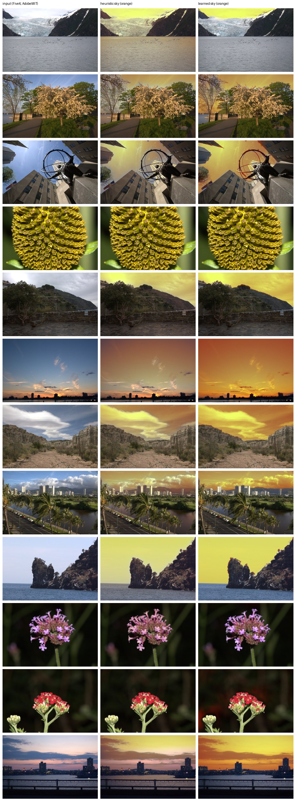

# Sky mask: heuristic vs. learned segmenter

**Adopted:** `photostyle/sky.py` (owner decision A4.5 #4). The model is
UperNet + ConvNeXt-tiny trained on ADE20K (`openmmlab/upernet-convnext-tiny`,
**MIT** licence, 60 M parameters). It runs on a ≤ 384 px proxy that keeps
the aspect ratio, and a guided filter re-snaps the mask edges to the full
image. If the model cannot be loaded, the heuristic from Phase 16 is used.
The atmosphere tools (haze, sky light) use it. The Phase 16 benchmark and
`RegionalRenderer` keep the heuristic, for reproducibility and training
speed.

**Licence scan (Hugging Face model cards):**
- **Permissive:** UperNet-ConvNeXt (MIT), OneFormer Swin-tiny (MIT),
  DPT-large-ADE (Apache-2.0, 1.4 GB).
- **"Other" (excluded):** NVIDIA SegFormer, Meta Mask2Former and
  MaskFormer.
- **Commercial caveat:** all of these were trained on ADE20K, whose images
  are for research. This is listed in the commercial checklist
  (PROJECT_PLAN A4.5).

*Orange = sky probability. Inputs: MIT-Adobe FiveK, Adobe-MIT licence.
`uv run python -m bench.sky_audit`.*

## Reading

- **Fixed by the model:**
  - water (glacier lake, harbour, sea) is no longer marked as sky;
  - snow and mist bands are separated from the sky above them;
  - macro close-ups get no sky;
  - pale, hazy skies are fully covered. These are what Clean Cool v1/v2
    greyed.
  - On the owner's photos (private sheet) it also finds **night skies**,
    which the heuristic cannot.
- **Remaining errors:** a little of a pale overpass face is marked as sky in
  one owner photo, less than with the heuristic.
- **Runtime:** about 0.5 s per photo on 4 CPU threads.
- **Metric caveat:** the mean sky probability in the bottom half of the
  frame is only a rough false-positive proxy (heuristic 0.090, model 0.104
  on FiveK). Some photos really have sky low in the frame (a sunset fills
  test_0017), so the figure is the evidence here. There is no ground truth
  for FiveK.
